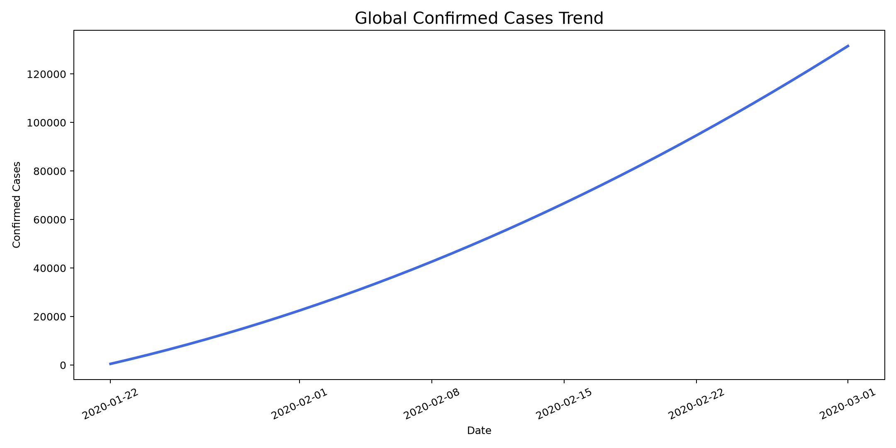
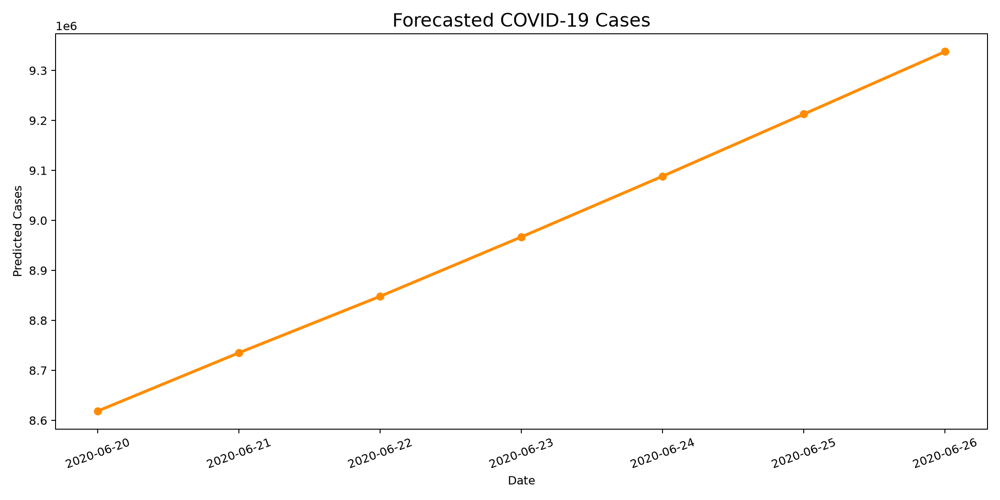

# COVID-19 Global Analysis 

<div align="center">


</div>

A data analysis and forecasting project focused on global COVID-19 trends using a public dataset of confirmed cases, deaths, recoveries, and active cases across countries.

## Project Overview

This project explores how COVID-19 evolved globally over time, identifies the countries with the highest impact, and builds a short-term forecasting model to estimate future confirmed case counts using Prophet.

## Goals

- Analyze global COVID-19 trends over time
- Clean and preprocess the raw dataset
- Visualize confirmed, death, and active case patterns
- Identify the most affected countries
- Forecast future cases using time-series modeling

## Dataset

The project uses the file `Covid.csv`, which contains the following fields:

- Province/State
- Country/Region
- Latitude
- Longitude
- Date
- Confirmed
- Deaths
- Recovered
- Active
- WHO Region

## Tech Stack

- Python
- Pandas
- NumPy
- Matplotlib
- Seaborn
- Prophet
- scikit-learn

## Repository Structure

```text
Covid ML/
├── Covid.csv
├── covid 19.ipynb
├── README.md
├── requirements.txt
└── outputs/
```

## Installation

1. Clone the repository:

```bash
git clone <your-repository-url>
cd "Covid ML"
```

2. Create a virtual environment:

```bash
python -m venv venv
```

3. Activate the environment:

- Windows:

```bash
venv\Scripts\activate
```

- macOS/Linux:

```bash
source venv/bin/activate
```

4. Install dependencies:

```bash
pip install -r requirements.txt
```

## Usage

Open the notebook `covid 19.ipynb` in Jupyter Notebook or VS Code and run the cells in order.

The notebook includes:

- Data loading and preprocessing
- Missing-value checks
- Exploratory data analysis
- Trend visualization
- Country-wise impact analysis
- Forecasting using Prophet

## Analysis Highlights

- Global confirmed cases were grouped by date and visualized over time
- Death and active case trends were examined over the pandemic period
- The countries with the highest confirmed, death, recovered, and active cases were identified
- A short-term forecast for future confirmed cases was generated

## Forecasting Results

The forecasting model reports the following evaluation metrics:

- MAE: approximately 1,510,422
- RMSE: approximately 1,811,726

These metrics provide a baseline for evaluating the model’s predictive performance on the selected dataset.

## Screenshots

### Global Confirmed Cases Trend



### Forecast Plot



## Notes

- This project is designed for educational and portfolio use.
- The dataset can be replaced with a newer version for more recent analysis.
- Prophet is well suited for short-term forecasting but may require tuning for more robust long-term predictions.

## Future Improvements

- Add dashboard-style visualizations
- Compare multiple forecasting models
- Include regional or country-level prediction analysis
- Build a deployment-ready report or web dashboard

## License

This project is licensed under the MIT License. See the [LICENSE](LICENSE) file for details.

## Author

Karan Gupta

LinkedIn / Portfolio: [your-link]
GitHub: [https://github.com/KaranGupta143](https://github.com/KaranGupta143)

---

If you want, I can also prepare a final polished version with your real name, GitHub username, and a stronger portfolio-style description.
